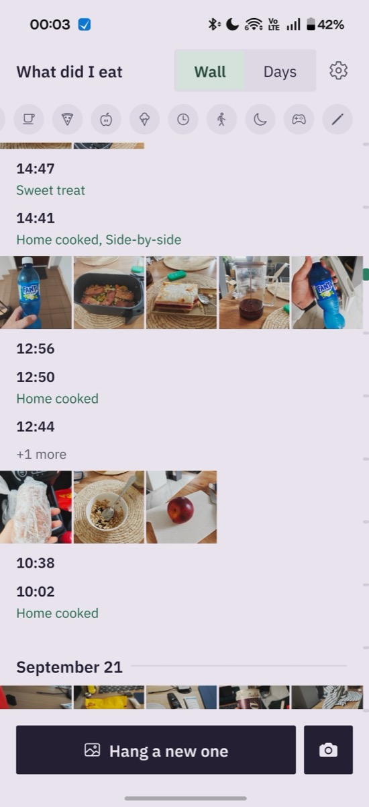
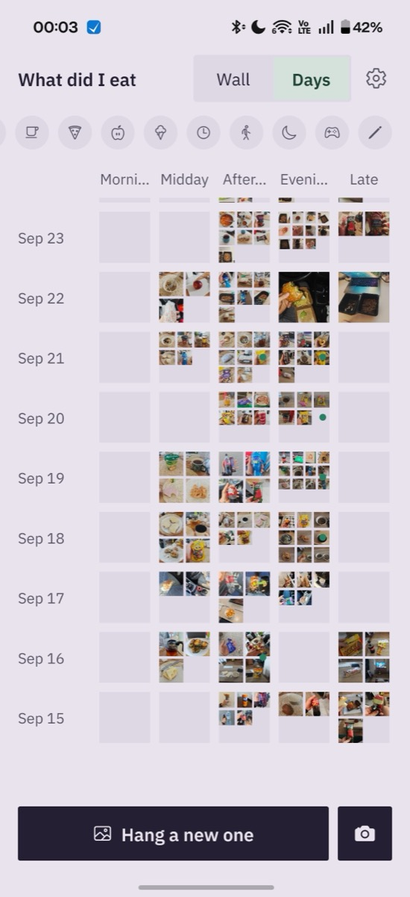
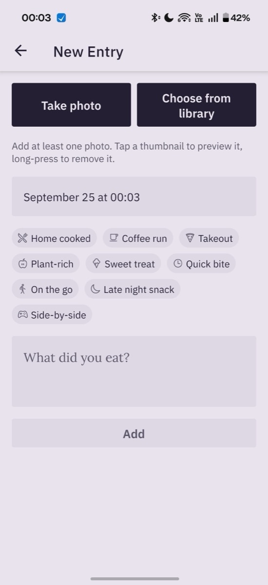
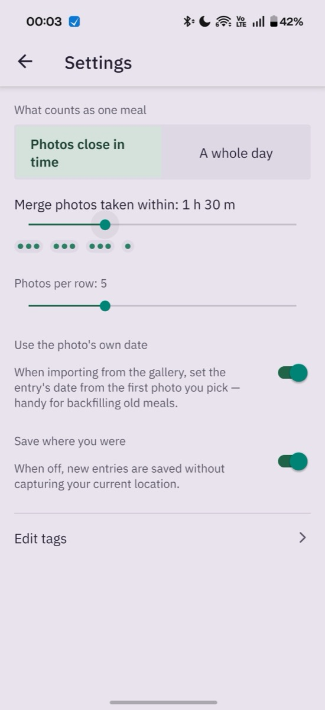

# What Did I Eat

**A photo food journal with no calories, no goals and no guilt.**

Snap what you eat. The app files each photo by meal and by day, so you can look back and
see what you actually ate. There are no calories, no macros and no daily targets.

  
  
  

## Why I built it

I wanted to think a little more about what I eat, without the calorie counting and weight
tracking that come with most food apps. Going over a calorie goal turns eating into
guilt, and exact numbers turn a meal into homework. I just wanted to notice what I eat.

Taking photos of my food was a good start. But the photos got lost among everything else
in my phone's gallery, and I had nowhere to write what the meal actually was. So this app
does three things:

- keeps your food photos in their own place, apart from your gallery
- groups them into meals and days automatically
- lets you add a note and tags to each meal

## What it does

- **The Wall.** Your home screen is one scrolling wall of photos. Photos taken close
  together are grouped into one meal automatically. Each meal shows its time, your note
  and its tags.
- **Days.** Switch to Days to see one row per day, with photos placed under Morning,
  Midday, Afternoon, Evening or Late. It shows your eating patterns at a glance. Tap a cell
  to jump to that meal on the Wall.
- **Quick logging.** Take a photo or pick some from your library, add tags like *Home
  cooked* or *Sweet treat*, write a line if you want, and save.
- **Tags and filters.** Filter the Wall by tag, and edit the tag list to fit how you eat.
- **Backfill old meals.** When you import from your gallery, the app can date the entry
  from the photo itself.
- **Your choice of grouping.** Decide how close together photos need to be to count as
  one meal, or group by whole day instead.

  

## Private by design

Everything stays on your phone. There's no account, no server, no cloud sync, no
analytics, no ads and no tracking. Photos are copied into the app's own storage, and
saving your location with an entry is optional (you can switch it off in Settings). See
the [privacy policy](PRIVACY.md).

## Get the app

The app runs on **Android** and **iOS**. App Store and Google Play listings are coming
soon. Until then, download it from
[GitHub Releases](https://github.com/mkloouo/what-did-i-eat/releases/latest):

- **Android:** download the `arm64-v8a` APK for most phones, or the `armeabi-v7a` APK
  for older 32-bit phones. If you're not sure, the `universal` APK works on every phone
  but is a bigger download. Your phone will ask you to allow installing from outside
  the store.
- **iOS:** there's an `.ipa` file, but you'll need a sideloading tool to install it.
- **Checking your download:** each release includes a `SHA256SUMS` file.

See the [changelog](CHANGELOG.md) for what's new in each version.

## Feedback

Found a bug or have an idea? [Open an issue](https://github.com/mkloouo/what-did-i-eat/issues)
or email [feedback@mkloouo.com](mailto:feedback@mkloouo.com).

## License

[PolyForm Noncommercial License 1.0.0](LICENSE): you're free to use, change and share it
for noncommercial purposes.

Looking for the original project notes? They're in [docs/old/README.md](docs/old/README.md).
