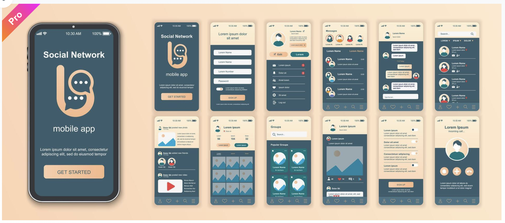
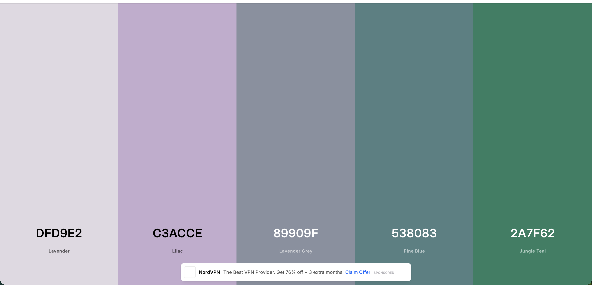

# What Did I Eat

## Vision

The purpose of this project is to shift my mind off of unnecessary things, like calories and weight tracking and just add some conscious thought to the food tracking. What food do I eat?

While I am working on making this more of a natural process (eating) instead of an addictive, disease-like state (emotional over-eating), I don't want to:
- guilt-trip myself which happens when you go over your desired calorie goals
- overcomplicate things with precise calculations

So, I thought it would be great to just track the food and what did I eat exactly. I started with taking a photo and having those in phone gallery seemed stupid, so I thought it would be great to:
- have those photos auto-group (with app storing them into a dedicated folder)
- have by day grouping
- have comments under each photo / photo group for the additional explanations on what was eaten

That's pretty much it.

## UI

Use flat design for the design system.
Create a design system.

Four? page app.

Page 1: config page

You should be able to toggle on and off bundling.
Bundling: is when we group all 1-day photos together instead of the default behaviour (group 1 hour interval)

Page 2: endfull (xD) scroll with my days and what I ate with comments

By default, the photos should stack in groups of 1 hour interval. We don't need to see the exact interval details, just see that when you've added another photo with comment, then it will join the group that was present for the last hour. The group time will update to the latest added photo time.

If day bundling option is selected, the photos should stack in groups of day.

Days (in both options) are separated with a divider.

Page 3: logging new entry

Select / Take a picture
Write down a comment
Add button

Page 4: group details screen - on photo group press

Scroll with photo items, large square photo and comment.

Page 5: photo details screen - on group photo item press / photo item press

When you are pressing an item (could be shown on a default version on the page 2) or an item on the group details screen.

Should have information where the photo was taken, when, comment and photo. Photo should be zoomable.

## Tech side

Should be done with react native + react navigation + redux toolkit (if needed) + any other lib

## License

[PolyForm Noncommercial License 1.0.0](LICENSE) — free to use, modify, and share for noncommercial purposes.
